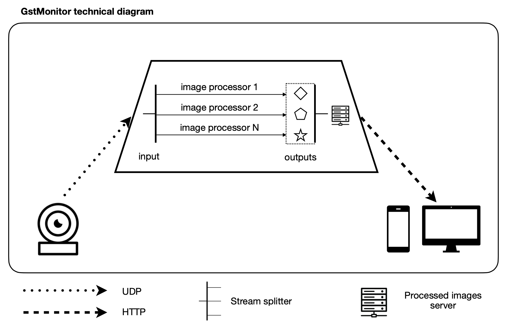
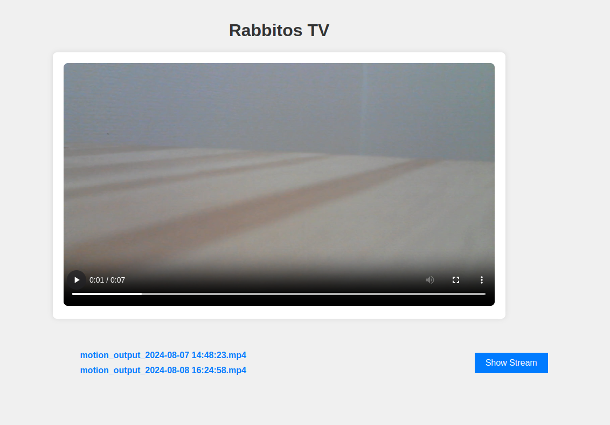

# gstMonitor

## Description

This project is a prototype application using GStreamer. Its main goal is to provide a proof of concept (POC) for utilizing GStreamer and image processing within a pipeline involving multiple systems, including acquisition, processing, and distribution.

The POC is structured as follows:

Video Stream [acquision](source/sender.cpp): Acquisition is performed using UDP transfer.

[Processing](source/dynamic/dynamic_gst.cpp): The received video stream is split into multiple pipelines, each dedicated to a specific processing step (e.g., OpenCV-based motion detection with file creation, generating files for HLS streaming).

[Display](source/flask/backend.py): A Flask server provides an on-demand display of the live stream acquired from the sender, along with a list of motion-detected segments.

*Figure 1: Diagram showing the architecture of the gstMonitor pipeline.*

*Figure 2: Screenshot of the Flask server displaying the live stream and motion-detected segments.*

## Futher work

The next step of this project is to add various image processing modules that can be loaded and unloaded dynamically, especially AI-powered processing modules.

Following this, a thorough analysis of the system’s capabilities and limitations will be conducted to guide the development of a more ambitious project with an optimized software architecture.

## License
@Todo
